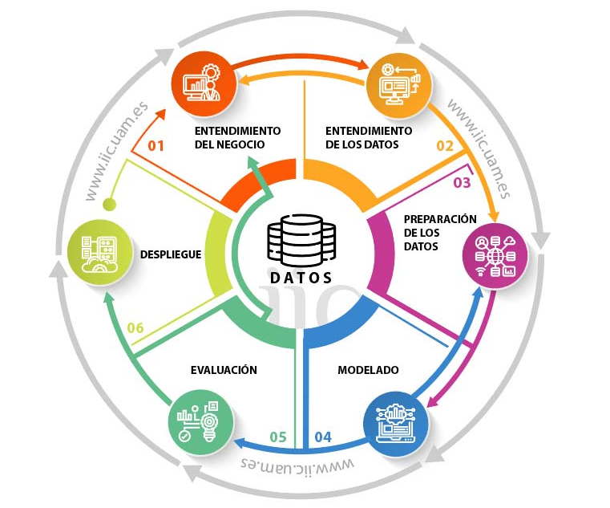

# CRISP-DM: Metodología Estándar en Ciencia de Datos

## ¿Qué es CRISP-DM?

**CRISP-DM** (Cross Industry Standard Process for Data Mining) es una metodología estándar e independiente del sector para planificar y ejecutar proyectos de minería de datos y análisis de datos. Fue desarrollada por un consorcio de empresas en 1996 y se ha convertido en el estándar de facto para proyectos de machine learning y análisis de datos.

CRISP-DM define un proceso estructurado en **6 fases principales** que se ejecutan de forma iterativa:

```
┌─────────────────────────────────────────────┐
│    1. COMPRENSIÓN DEL NEGOCIO              │
│       (Business Understanding)              │
└────────────────┬────────────────────────────┘
                 │
┌────────────────▼────────────────────────────┐
│    2. COMPRENSIÓN DE LOS DATOS             │
│       (Data Understanding)                  │
└────────────────┬────────────────────────────┘
                 │
┌────────────────▼────────────────────────────┐
│    3. PREPARACIÓN DE LOS DATOS             │
│       (Data Preparation)                    │
└────────────────┬────────────────────────────┘
                 │
┌────────────────▼────────────────────────────┐
│    4. MODELADO                             │
│       (Modeling)                            │
└────────────────┬────────────────────────────┘
                 │
┌────────────────▼────────────────────────────┐
│    5. EVALUACIÓN                           │
│       (Evaluation)                          │
└────────────────┬────────────────────────────┘
                 │
┌────────────────▼────────────────────────────┐
│    6. DESPLIEGUE                           │
│       (Deployment)                          │
└──────────────────────────────────────────────┘
       ▲                                   │
       │                                   │
       └───────────────────────────────────┘
           (Proceso Iterativo)
```


---

## ¿Por qué se utiliza CRISP-DM en Análisis de Datos?

### 1. **Estructura y Organización**
- Proporciona un marco claro y metodológico para evitar caos en los proyectos
- Reduce riesgos de fallos costosos al seguir un proceso probado
- Facilita la comunicación entre equipos (data scientists, ingenieros, stakeholders)

### 2. **Eficiencia**
- Evita trabajo innecesario al definir objetivos claros desde el inicio
- Reduce el tiempo de desarrollo mediante una planificación adecuada
- Minimiza retrabajos al tener criterios de éxito bien definidos

### 3. **Independencia de Herramientas**
- No está ligada a ningún software específico (R, Python, Tableau, SQL, etc.)
- Es agnóstica del dominio (aplicable a finanzas, medicina, marketing, etc.)

### 4. **Retroalimentación y Mejora Continua**
- Está diseñada para ser iterativa: puedes volver a fases anteriores
- Permite aprender de los resultados y mejorar constantemente
- Facilita la incorporación de nuevos requisitos

### 5. **Documentación y Reproducibilidad**
- Asegura que el proceso sea documentado y reproducible
- Fundamental para auditorías y conformidad normativa (especialmente en finanzas y salud)

---

## Las 6 Fases de CRISP-DM en Machine Learning

### **Fase 1: Comprensión del Negocio (Business Understanding)**

**Objetivo:** Definir qué queremos lograr y por qué

**Actividades principales:**
- Definir el problema o pregunta de negocio
- Identificar objetivos medibles
- Evaluar viabilidad y riesgos
- Definir criterios de éxito

**Ejemplo en tus proyectos:**
- **Titanic**: ¿Podemos predecir quién sobrevivió basándonos en características como edad, género y clase de pasaje?
- **Admittance**: ¿Podemos predecir si un estudiante será admitido basándonos en puntuaciones GRE y GPA?
- **Precios de Automóviles**: ¿Podemos predecir el precio de un auto basándonos en características técnicas?

---

### **Fase 2: Comprensión de los Datos (Data Understanding)**

**Objetivo:** Explorar y familiarizarse con los datos disponibles

**Actividades principales:**
- Recolectar datos iniciales
- Realizar análisis exploratorio (EDA - Exploratory Data Analysis)
- Identificar calidad de datos (valores faltantes, outliers, inconsistencias)
- Visualizar distribuciones y relaciones

**Ejemplo en tus notebooks:**

**En `Linear Regresion - Precios de automoviles.ipynb`:**
```python
import pandas as pd

# Cargar y explorar datos
file_path = 'Automobile_price_data.csv'
df = pd.read_csv(file_path)

# Analizar estructura
print(df.head())          # Primeras filas
print(df.info())          # Información del dataset
print(df.describe())      # Estadísticas descriptivas
print(df.isnull().sum())  # Valores faltantes

# Visualizar relaciones
df[['engine-size', 'horsepower', 'price']].corr()  # Correlaciones
```

**En `Regresion Logistica Clasificacion - titanic.ipynb`:**
- Explorar características del dataset Titanic (edad, género, clase, tarifa, etc.)
- Entender la distribución de supervivientes vs no supervivientes
- Identificar valores faltantes en 'Age' y 'Cabin'

---

### **Fase 3: Preparación de los Datos (Data Preparation)**

**Objetivo:** Limpiar y transformar datos para que estén listos para modelado

**Actividades principales:**
- Manejar valores faltantes (imputación, eliminación)
- Tratar outliers
- Codificar variables categóricas (one-hot encoding, label encoding)
- Normalización/Escalado de características
- Feature engineering (crear nuevas características)
- División train/test

**Ejemplo en tus notebooks:**

**En `Multiple_Linear_Regression_RFR_Case_Study - Precios de automoviles 3.ipynb`:**
```python
from sklearn.model_selection import train_test_split
from sklearn.preprocessing import StandardScaler

# Seleccionar características y target
X = df[['engine-size', 'horsepower', 'city-mpg', 'highway-mpg']]
y = df['price']

# Dividir datos
X_train, X_test, y_train, y_test = train_test_split(
    X, y, test_size=0.2, random_state=42
)

# Normalizar características
scaler = StandardScaler()
X_train_scaled = scaler.fit_transform(X_train)
X_test_scaled = scaler.transform(X_test)
```

**En `Admittance_Logistic_Regression_Random_Forest.ipynb`:**
- Cargar y preparar datos de Admittance
- Manejar características numéricas (GRE, GPA)
- Preparar variable objetivo (admitido/no admitido)

---

### **Fase 4: Modelado (Modeling)**

**Objetivo:** Construir y entrenar modelos de machine learning

**Actividades principales:**
- Seleccionar algoritmos apropiados
- Ajustar hiperparámetros
- Entrenar modelos
- Usar validación cruzada
- Evaluar rendimiento en datos de entrenamiento

**Ejemplo en tus notebooks:**

**En `Titanic_XGBoost_Classifier.ipynb`:**
```python
from xgboost import XGBClassifier
from sklearn.metrics import accuracy_score, confusion_matrix

# Crear y entrenar modelo XGBoost
model = XGBClassifier(
    n_estimators=100,
    max_depth=5,
    learning_rate=0.1,
    random_state=42
)
model.fit(X_train, y_train)

# Predicciones en entrenamiento
y_pred_train = model.predict(X_train)
train_accuracy = accuracy_score(y_train, y_pred_train)
```

**En `Multiple_Linear_Regression_RFR_Case_Study - Precios de automoviles 3.ipynb`:**
```python
from sklearn.linear_model import LinearRegression
from sklearn.ensemble import RandomForestRegressor

# Modelo 1: Regresión Lineal
lr_model = LinearRegression()
lr_model.fit(X_train_scaled, y_train)

# Modelo 2: Random Forest Regressor
rf_model = RandomForestRegressor(
    n_estimators=100,
    max_depth=10,
    random_state=42
)
rf_model.fit(X_train_scaled, y_train)
```

---

### **Fase 5: Evaluación (Evaluation)**

**Objetivo:** Evaluar rigorosamente la calidad del modelo

**Actividades principales:**
- Evaluar en datos de prueba (nunca vistos antes)
- Calcular métricas de rendimiento apropiadas
- Comparar múltiples modelos
- Validar que cumpla criterios de éxito del negocio
- Análisis de errores y diagnosticar problemas

**Ejemplo en tus notebooks:**

**En `Multiple_Linear_Regression_RFR_Case_Study - Precios de automoviles 3.ipynb`:**
```python
from sklearn.metrics import r2_score, mean_squared_error, mean_absolute_error
import numpy as np

# Predicciones en conjunto de prueba
y_pred = lr_model.predict(X_test_scaled)

# Métricas
r2 = r2_score(y_test, y_pred)                    # R² = 0.687
rmse = np.sqrt(mean_squared_error(y_test, y_pred))
mae = mean_absolute_error(y_test, y_pred)        # MAE ≈ $2361.55

print(f"R² Score: {r2:.4f}")
print(f"RMSE: ${rmse:.2f}")
print(f"MAE: ${mae:.2f}")
```

**En `Regresion Logistica Clasificacion - titanic.ipynb`:**
```python
from sklearn.metrics import (
    accuracy_score, precision_score, recall_score, 
    f1_score, confusion_matrix, roc_auc_score
)

# Métricas de clasificación
accuracy = accuracy_score(y_test, y_pred)
precision = precision_score(y_test, y_pred)
recall = recall_score(y_test, y_pred)
f1 = f1_score(y_test, y_pred)
auc = roc_auc_score(y_test, y_pred_proba)

print(f"Accuracy: {accuracy:.4f}")
print(f"Precision: {precision:.4f}")
print(f"Recall: {recall:.4f}")
print(f"F1-Score: {f1:.4f}")
print(f"AUC: {auc:.4f}")
```

---

### **Fase 6: Despliegue (Deployment)**

**Objetivo:** Implementar el modelo en producción

**Actividades principales:**
- Crear un plan de despliegue
- Integrar el modelo en sistemas existentes
- Monitorear rendimiento en producción
- Documentar procesos y decisiones
- Establecer procedimientos de reentrenamiento

**Ejemplo en tus proyectos:**

**Tu archivo `predict_admittance.py` es un ejemplo de despliegue:**
```python
# Cargar modelo entrenado y hacer predicciones
# Este es un módulo que podría ser usado en producción
import pickle
import pandas as pd

# Cargar modelo
with open('mejor_modelo_titanic.pkl', 'rb') as f:
    model = pickle.load(f)

# Hacer predicciones sobre nuevos datos
def predict_admittance(gre_score, gpa):
    """Predecir admisión para un nuevo estudiante"""
    return model.predict([[gre_score, gpa]])
```

---

## Ciclo Completo: Ejemplo Práctico con el Dataset de Titanic

### Paso a paso CRISP-DM:

#### **1. Comprensión del Negocio**
- **Pregunta:** ¿Qué características determinaban la supervivencia en el Titanic?
- **Objetivo:** Construir un clasificador que prediga supervivencia
- **Métrica de éxito:** Accuracy > 80%

#### **2. Comprensión de Datos**
```python
import pandas as pd
df = pd.read_csv('Titanic.csv')

# Exploración
df.head()           # Ver estructura
df.info()           # Valores faltantes: Age (177), Cabin (687)
df.describe()       # Estadísticas
df['Survived'].value_counts()  # Distribución: 38% sobrevivió, 62% no
```

#### **3. Preparación de Datos**
```python
# Manejar valores faltantes
df['Age'].fillna(df['Age'].median(), inplace=True)
df['Embarked'].fillna(df['Embarked'].mode()[0], inplace=True)

# Codificar variables categóricas
df['Sex'] = df['Sex'].map({'male': 0, 'female': 1})
df = pd.get_dummies(df, columns=['Embarked'], drop_first=True)

# Seleccionar características
X = df[['Pclass', 'Sex', 'Age', 'SibSp', 'Parch', 'Fare', 'Embarked_Q', 'Embarked_S']]
y = df['Survived']

# Dividir datos
from sklearn.model_selection import train_test_split
X_train, X_test, y_train, y_test = train_test_split(X, y, test_size=0.2)
```

#### **4. Modelado**
```python
# Probar múltiples modelos
from sklearn.linear_model import LogisticRegression
from sklearn.ensemble import RandomForestClassifier
from xgboost import XGBClassifier

models = {
    'Logistic Regression': LogisticRegression(),
    'Random Forest': RandomForestClassifier(n_estimators=100),
    'XGBoost': XGBClassifier(n_estimators=100)
}

for name, model in models.items():
    model.fit(X_train, y_train)
```

#### **5. Evaluación**
```python
from sklearn.metrics import accuracy_score, f1_score

for name, model in models.items():
    y_pred = model.predict(X_test)
    acc = accuracy_score(y_test, y_pred)
    f1 = f1_score(y_test, y_pred)
    print(f"{name}: Accuracy={acc:.4f}, F1={f1:.4f}")
    # Seleccionar el mejor modelo
```

#### **6. Despliegue**
```python
# Guardar el mejor modelo
import pickle
with open('mejor_modelo_titanic.pkl', 'wb') as f:
    pickle.dump(best_model, f)

# Crear función de predicción
def predict_survivor(pclass, sex, age, sibsp, parch, fare):
    """Predecir si un pasajero sobrevivió"""
    input_data = [[pclass, sex, age, sibsp, parch, fare, 0, 0]]
    return best_model.predict(input_data)
```

---

## Comparación: Cómo tus proyectos siguen CRISP-DM

| Proyecto | Fase 1 | Fase 2 | Fase 3 | Fase 4 | Fase 5 | Fase 6 |
|----------|--------|--------|--------|--------|--------|--------|
| **Titanic** | Predecir supervivencia | EDA del dataset | Imputación, encoding | Logística + XGBoost | Métricas de clasificación | `predict_admittance.py` |
| **Admittance** | Predecir admisión | Explorar características | Normalización | Logística + RF | Precisión, Recall | Modelo serializado |
| **Auto Prices** | Predecir precio | Análisis correlaciones | Escalado | Regresión lineal + RF | R², RMSE, MAE | Predicciones en test |

---

## Ventajas de seguir CRISP-DM

✅ **Claridad**: Todos entienden qué fase es y qué se espera  
✅ **Iteración**: Puedes volver atrás si descubres problemas  
✅ **Documentación**: Facilita mantener y mejorar el proyecto  
✅ **Escalabilidad**: Funciona desde proyectos pequeños hasta empresariales  
✅ **Reducción de riesgo**: Evita gastarse en dirección equivocada  
✅ **Comunicación**: Mejora diálogo entre técnicos y stakeholders  

---

## Resumen: Las 6 Fases en Una Línea

1. **Business Understanding**: "¿Qué queremos predecir y por qué?"
2. **Data Understanding**: "¿Qué datos tenemos y qué significan?"
3. **Data Preparation**: "¿Cómo limpiamos y preparamos los datos?"
4. **Modeling**: "¿Qué algoritmo es mejor para este problema?"
5. **Evaluation**: "¿Funciona bien nuestro modelo?"
6. **Deployment**: "¿Cómo lo llevamos a producción?"

**Recuerda**: Es un proceso *iterativo*, no lineal. Normalmente necesitarás volver a fases anteriores basándote en lo que aprendas.
